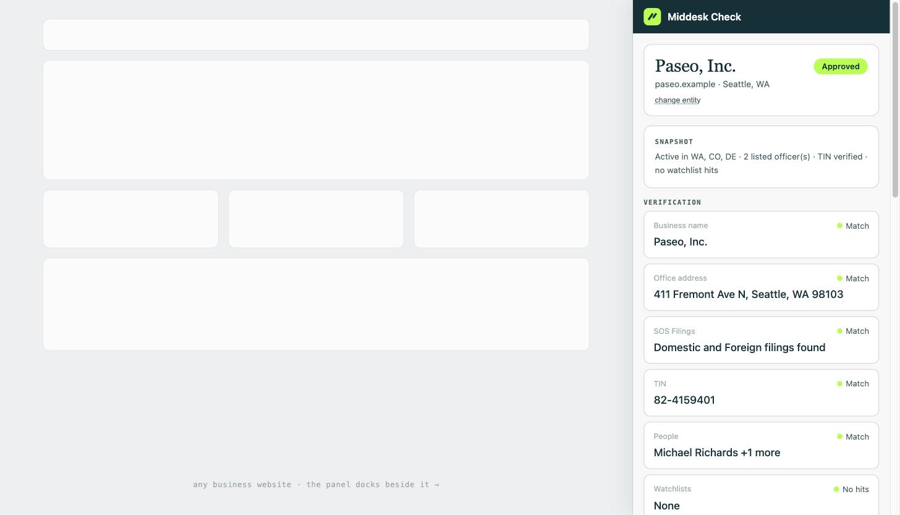

# Middesk Check

A Chrome side-panel that answers *"is this company real?"* without leaving the page: it identifies the legal entity behind the business website you're on, you confirm the match, and it renders a public-record snapshot — registration status, SEC presence, sanctions screen, domain age — every row linked to its government source.

**Concept demo by a candidate. Not affiliated with Middesk.** It borrows Middesk's design language deliberately: the concept is a free GTM surface for their paid KYB platform, so the panel is built to read like a detached window of their product. Rows only the paid API can fill (TIN match, all-50-state coverage, liens, Business Connections) render as locked rows — the funnel, visible in the UI.

## Status

- [x] **Phase 1 — UI shell.** Side panel + dock harness, full design-token treatment, loading & empty states.
- [x] **Phase 1.5 — Middesk-schema ingestion path.** `fixtures/middesk-api.json` is a Business response in their documented schema, rendered through the same `rowsFromMiddesk()` mapper the live fetch uses; `fetchMiddeskBusiness()` is implemented and dormant behind a key.
- [x] **Phase 2 — product-fidelity pass.** Their report grammar throughout: verification stack with match verdicts, lifecycle status pill, Fraud-intelligence tally, verifying toast, app-density type scale; scope pinned to core verification with a click-out CTA for the full platform.
- [x] **Phase 2.5 — the demo browser.** `npm run build:demo` builds a believable Chrome window (`harness.html`) with one tab per demo business — three fictional KYB-typical companies (established manufacturer, contractor with a lapsed registration, fraud-shaped young merchant), each a token-themed landing page — and the real panel embedded as an iframe, opened from a pinned extension icon. The panel has no knowledge of the harness; tabs switch businesses via `?business=<id>`. Deployable anywhere static as the zero-install link.
- [ ] **Phase 3 — optional live public-record adapters.** The public-launch path from the GTM proposal (EDGAR, state open data, OFAC/CSL, FinCEN MSB, GLEIF, RDAP + a small Worker), plus the page-extraction + candidate-confirm flow; not required for the interview demo.

## Run it

```sh
npm install
npm run dev          # then open http://localhost:5173/sidepanel.html?fixture=paseo
```

The dock harness simulates Chrome's side panel next to a mock webpage; click **Verify this business** to play the flow (verifying toast → full report).

**As the real side panel:** `npm run build`, then chrome://extensions → enable Developer mode → Load unpacked → select `dist/` → click the Middesk Check toolbar icon on any tab. The panel opens with sample-data buttons until Phase 2 wires live sources. After code changes: rebuild, then hit ↻ on the extension card.



## Architecture

```
page (on click, activeTab only)
  └─ extractor: schema.org Organization → footer © line → ToS naming
       └─ side panel: candidates + confidence → USER CONFIRMS
            └─ service worker: fan-out over source adapters (Promise.allSettled)
                 ├─ adapters/edgar      SEC submissions + full-text (keyless, public domain)
                 ├─ adapters/socrata    CO · NY · CT · OR · TX registries (keyless open data)
                 ├─ adapters/csl        Trade.gov consolidated sanctions (key → Worker)
                 ├─ adapters/msb        FinCEN MSB registrants (pre-baked index)
                 ├─ adapters/gleif      LEI + parent/child relationships (CC0)
                 ├─ adapters/rdap       domain registration date (keyless)
                 └─ adapters/middesk    ← the production seam (see below)
                      └─ renderer: normalized ProfileRow[] → sectioned card
```

Design decisions worth stating:

- **`adapters/middesk.ts` exists from day one, typed against Middesk's documented API shapes, deliberately inert.** The free-source fleet exists because Middesk's API is sales-gated; if a key is wired in, one `POST /v1/businesses` replaces all of it. The adapter interface is the pitch, in code.
- **Status vocabulary mirrors Middesk's review tasks** (`success`/`warning`/`failure`) so their API maps in without renames.
- **Demo scope is one polished flow** — verify → report — pinned to core verification, with a click-out CTA for everything deeper (liens, connections, monitoring). The page-extraction and candidate-confirm flow from the GTM proposal returns with the live adapters in Phase 3 (its earlier implementation lives in git history).
- **No LLM in the data path.** Parse → query → render. A row either cites a government source or shows a designed absence; the tool is hallucination-free by construction.
- **Every rendered field maps to their documented schema** (verified against the reference pages): Business, Registration, TIN (`tin`, `verified`, `mismatch`), Watchlist, Website (`description`, `domain.creation_date`) are verbatim shapes. The one composite is `risk_assessment`: their Risk Assessment is a separate resource (`GET /risk_assessments/latest`, linked via `business.risk.latest_assessment_id`) whose real `score`/`level`/`title` fields the demo uses — the Snapshot headline *is* their `title` field ("one-sentence analyst headline") — with the dashboard's Positive/Neutral/Negative tally condensed as `indicators`. Production makes the second call.
- **The live path is wired, not hypothetical.** `Verify` checks `chrome.storage` for a `middeskAccess` config (proxy URL or sandbox key, entered at runtime); if present, the panel calls the real API through the adapter and renders whatever comes back — same components, same mapper. Without it, the API-schema fixture renders with demo latency.
- **Vanilla TypeScript, no framework.** A panel of list rows doesn't need React; reviewers can read the whole thing in one sitting.

## Security posture

Built to be read by a security-conscious buyer; the threat model is part of the demo.

- **No secrets can exist in this codebase.** Extension bundles are world-readable, so the Middesk API key lives server-side only (`proxy` mode in `adapters/middesk.ts`). The `direct-sandbox` mode is for local demos with your own sandbox key, entered at runtime into `chrome.storage` — never bundled, never committed. (Middesk ships no npm SDK — their docs' JavaScript examples are raw REST, which is what the adapter and the future proxy speak.)
- **XSS-safe by construction.** Every render goes through DOM `textContent` (no `innerHTML` anywhere), so strings scraped from arbitrary webpages cannot inject markup into the panel.
- **Least privilege.** `activeTab` + `scripting` + `sidePanel` + `storage`; zero blanket host permissions; a page is read only when the user clicks the icon on that tab.
- **Minimal egress.** Nothing leaves the browser except the entity name the user confirmed — never the URL, never page content. No analytics, no tracking, no third-party scripts.
- **MV3 baseline.** No remote code, strict default CSP, all assets bundled; **zero runtime npm dependencies** (dev toolchain only), so there is effectively no supply chain to attack.
- External links open with `rel="noopener"`.

## Privacy stance

The only data that ever leaves the browser is the entity name the user confirms, sent to public government APIs (and, in Phase 2, one caching proxy). Never the URL, never page content, no account, no tracking. `activeTab` means zero host permissions on the sites you browse — the extension cannot see any page until you click it.

## Design language

Tokens verified against middesk.com's shipped CSS and product screenshots: midnight `#0B3139`, lime `#A7FF1C` (one accent moment per view, never wallpaper), snow `#F8F8F8`, borders `#CED6D7`; status colors sampled from their real app (`#0D7435` hollow-ring pass, `#C4440E` warning, `#CD2523` fail). Their licensed typefaces (ABC Arizona Serif, ABC Monument Grotesk) are **not** bundled — the panel falls back to Georgia + system-ui, and swapping the real faces in is a licensed-font drop-in.

## Honest limits

Free public sources cover roughly half of real-world lookups end-to-end (six states publish usable registry data; Delaware publishes none). No free source can verify an EIN/TIN, and US beneficial-ownership data does not publicly exist. Those gaps render as locked rows rather than being papered over — in a GTM demo, the gap *is* the pitch.
