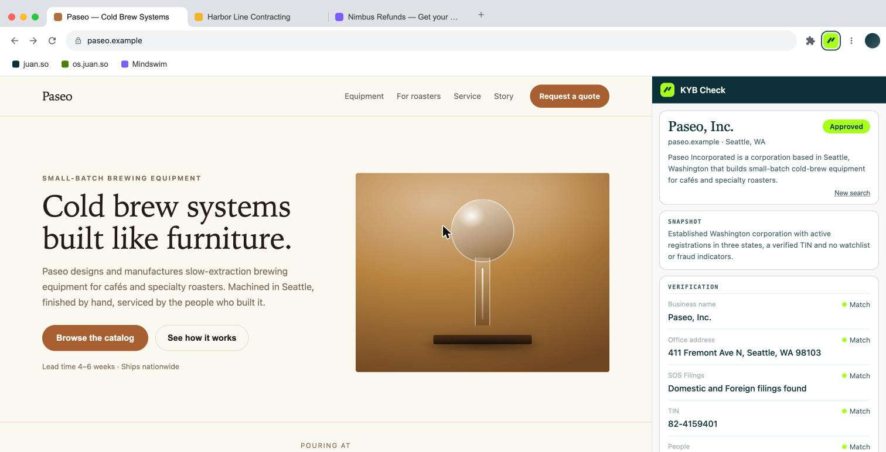
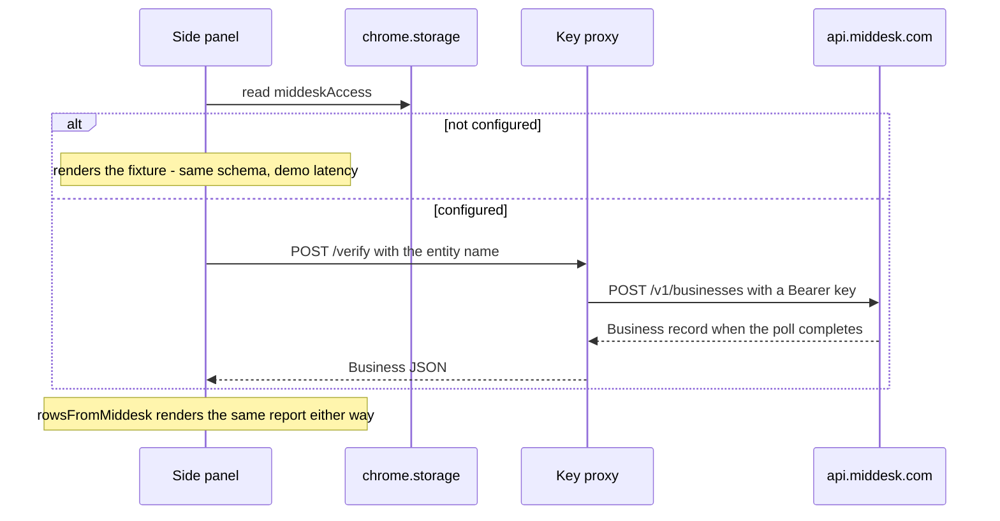

# KYB Check

A concept Chrome extension built for [Middesk](https://www.middesk.com): open the side panel on a business website and get a verification report — registration status by state, TIN match, watchlists, officers, fraud indicators — rendered in Middesk's own report grammar. Candidate work sample; not affiliated with Middesk.

**Live demo: [mindswim.co/kyb-check](https://mindswim.co/kyb-check)**



## Why this exists

Middesk sells business verification (KYB) through a sales-led API. Its buyers — risk, compliance, and onboarding teams — research businesses all day, yet there is no free surface where that daily work touches Middesk data. A side panel that verifies the site you are on is the free-tool wedge (Clearbit Connect, Wappalyzer) applied to KYB, a category where no credible brand ships one. The panel handles core verification; everything deeper links out to a demo request carrying UTM attribution, so the extension is a measurable channel.

## Try it

The hosted demo above is a simulated Chrome window — three fictional businesses, the real panel docked beside them, nothing to install. Locally:

```sh
npm install
npm run build:demo && npm run preview:demo   # http://localhost:4174/harness.html
```

Switch tabs to change business, click **Verify this business**, and the ghost report you are looking at fills in place. Verify on a bookmarked personal site to see the no-business-found state.

As a real extension: `npm run build`, then chrome://extensions → Developer mode → Load unpacked → `dist/`. The panel opens from the toolbar icon.

| Business | Verdict |
|---|---|
| Paseo, Inc. — Seattle equipment manufacturer | Approved, clean report |
| Harbor Line Contracting LLC — Tacoma contractor | Approved, one lapsed foreign registration |
| Nimbus Refunds, Inc. — weeks-old Delaware merchant | In review: TIN name mismatch, watchlist hit, young domain |

Paseo is Middesk's own recurring fictional demo company; the other two are invented. Every value on screen is fixture data in Middesk's documented schema.

## How it works

```
src/
  panel/      the extension UI (side panel)
  adapters/   middesk.ts — API types, mappers, live fetch
  core/       domain types + snapshot-headline generator (tested)
  fixtures/   one Business response per demo company, in their documented schema
  harness/    demo only — the simulated Chrome window and three themed sites
  lib/        shared DOM and overlay-scrollbar helpers
```

`npm run build` emits only the extension. The demo browser is a separate build (`build:demo` → `dist-demo/`) that embeds the real `sidepanel.html` in an iframe; the panel has no knowledge of the harness.

## Connecting the real API



Verify checks `chrome.storage` for a `middeskAccess` config. Without one, the panel renders fixtures through the same mapper the live path uses. With one, the identical flow calls the API: Bearer auth, `POST /v1/businesses`, then polling while Middesk's pipelines fill the record (their flow is asynchronous; production would use webhooks). Field names — `registrations[].sub_status`, `tin.verified`, `website.description`, `risk_assessment.title` — were checked against their reference docs. One deliberate simplification: risk assessments are a separate resource (`GET /risk_assessments/latest`), which production fetches with a second call; the report's Snapshot headline is that resource's `title` field, their "one-sentence analyst headline."

Keys cannot ship in this bundle — extension code is world-readable — so proxy mode, with the key server-side, is the only shippable configuration. `direct-sandbox` mode exists for local demos with your own key entered at runtime.

## From demo to product

The point of a free tool is qualified leads, so production adds the gate at the right moment: a handful of free verifications, then sign-in with a business email — the audience filter and the lead — to continue. The proxy holds the Middesk key, enforces the quota, and caches. Deeper capabilities (liens, bankruptcies, business connections, monitoring) stay behind the demo click-out. Also required before shipping publicly: Middesk's sign-off on brand and data use, live page extraction to resolve arbitrary sites to legal entities, store-listing assets (icons are not yet drawn), a privacy policy, and QA against real sandbox responses.

## Security

- No secrets exist or can exist in this codebase; the API key lives server-side only.
- Least privilege: `activeTab`, `scripting`, `sidePanel`, `storage`. The one granted origin is `api.middesk.com` for the live path — no host access to the sites you browse; a page is read only when the user clicks the icon.
- All rendering goes through DOM `textContent` — no `innerHTML` — so strings scraped from arbitrary pages cannot inject markup.
- Nothing leaves the browser except the entity name being verified. No analytics, no tracking.
- Zero runtime npm dependencies; `npm audit` is clean; CI runs lint, tests, and both builds on every push.

## Development

```sh
npm test          # 12 tests on the pure logic (mappers, headline generator)
npm run lint
npm run build     # extension → dist/
npm run build:demo
```

MIT © Juan Ruiz
